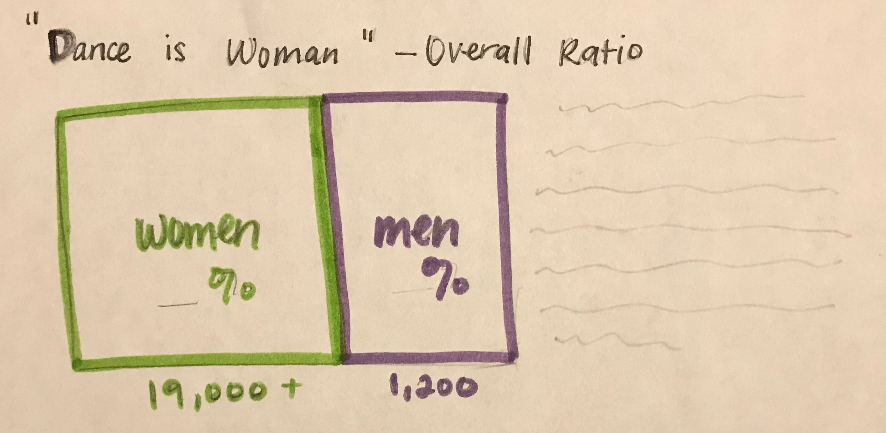
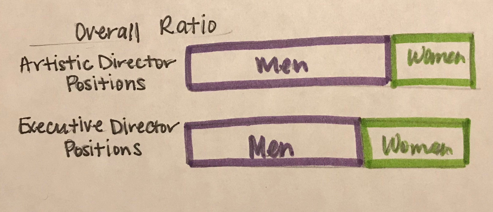
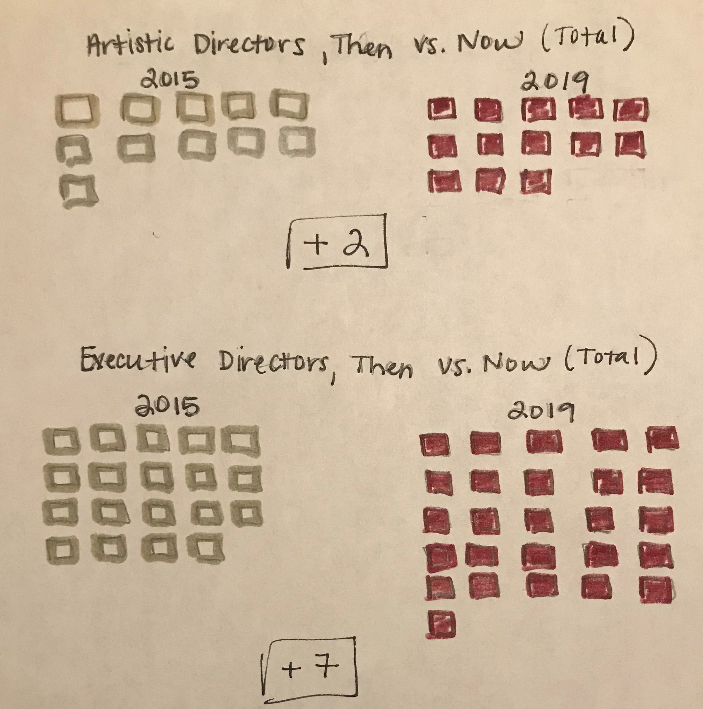
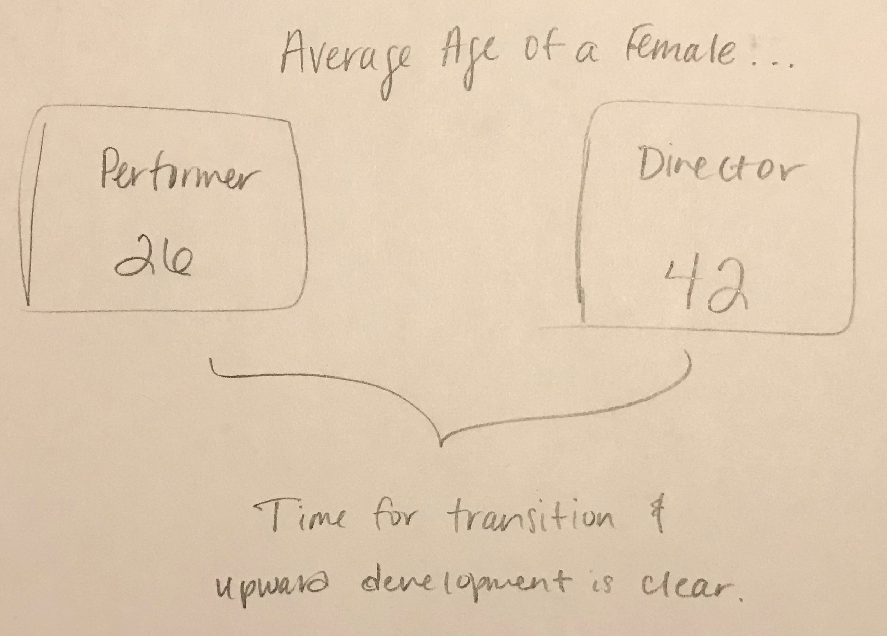
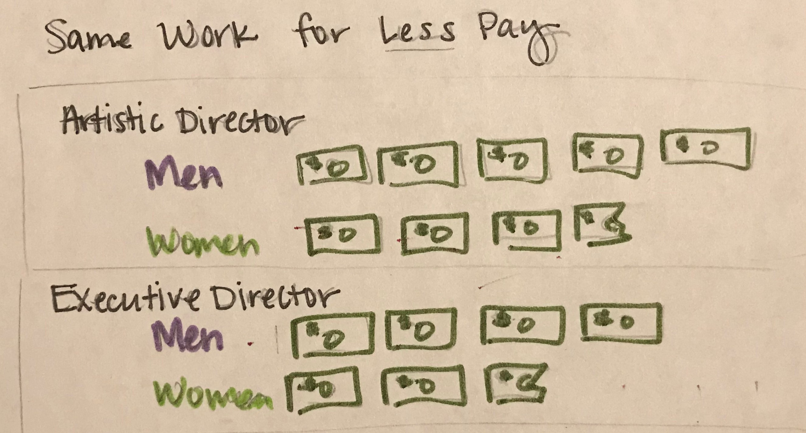
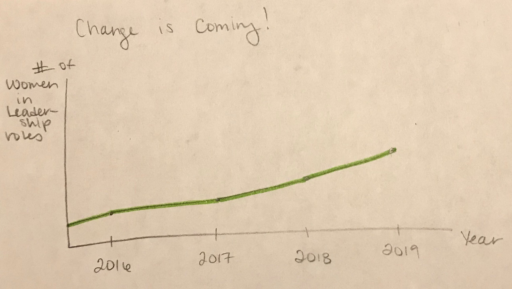
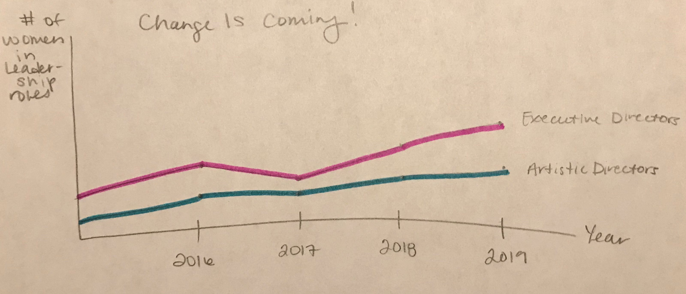

# My Final Project - "Dance is Woman, but it's Leadership is not"

# Project Outline
My project will be looking at the gender and pay disparities found in the leadership roles of the dance industry, advocating for more support and mentorship for women who seek to fill those positions. For the purposes of this project, leadership will be defined as artistic directors and executive directors. 

**Project Structure**

I see my project including the following touchpoints:
* Overall number of women in the dance industry vastly outweights that of men.
* Opportunities to find female mentors are nearly endless.
* Men, though the industry minority, hold the majority of leadership positions.
  * Women are also paid significantly less than their male counterparts in the same positions.
* Change is on the horizon! More women are now holding these positions.
* Call to Action: 
  * Support research being done to understand the gender and pay gap within the dance industry, and
  * Mentorship programs for women in the arts who want to be artistic and executive directors.
  
# My Data
The data I'm using for this story comes from a couple different locations. The first is from the ["2020 Leadership Report"](Leadership-Report-2020.pdf), published by the Dance Data Project. This report outlines the latest industry-specific information on how many men and women can be found in artistic and executive director positions within the dance industry. From this, I'll pull numerical statistics on job counts and pay differences that compare the previous 5 years. That will allow me to present a deep dive into the current realities for women in dance leadership, both from a standpoint of potential for upward mobility and how much they are likely to earn by recreating data sets that were compiled from a number of other sources. 
  
The second is the National Endowment for the Arts' report, ["Artists and Other Cultural Workers: A Statistical Portrait"](Artists_and_Other_Cultural_Workers.pdf). This report pulls together information from the U.S. Census Bureau's American Community Survey (ACS, 5-year estimates) and the U.S. Bureau of Labor Statistic's Current Population Survey (CPS) to look at how many individuals are employed within the arts industry as a whole. What this report will allow me to do is dive into the overall gender breakdown seen within the industry, emphasizing how the gender majority is disparate to the salaries that are available. Additionally, I'll be able to pull in information about age differences between the average dancer and the average director, pointing out that movement towards leadership positions would be seen as a natural next step following an career on the stage for many, but the current climate and culture discourages such a move. *Data tables for this report can be found here: [Tables 1a-1b](Tables1a-1b.xlsx), [Tables 2a-2b](Tables2a-2b.xlsx), [Tables 3a-3b](Tables3a-3b.xlsx), [Tables 4a-4b](Tables4a-4b.xlsx).* 
  
# Method/Medium
To showcase my story, I plan on creating a digital platform using Shorthand, as it operates much like a typical website might - at least to the viewer. All data visualizations 
will be created and implemented digitally, using either Flourish or Tableau, depending on the chart type, with a consistent color theme carried throughout. In an effort to ensure viewers spend as little time possible figuring out the charts, I plan on creating a layout that engages without being distracting, such as alternating charts and text order (chart, then text; text then chart, laid out left to right). This layout would also endeavor to take advantage of implementing white space to minimize distractions and simultaneously emphasize any pull out quotes or statistics I might choose to include. 

**Sample Wireframes of Data Visualizations**

    

 !{Wireframe4](IMG_0307.jpg)

 

 
