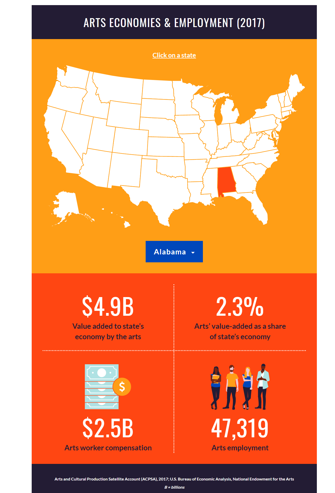

# Critique by Re-Design

The chart I chose for this exercise, shown below, is one that is serviceable to its audience, but makes assumptions about how arts managers would prefer to view and understand the data, as well as their capability. It's interactivity makes for an engaging chart, but the necessity of clicking back and forth between states makes comparison difficult and tedious. Lacking a clear story outside of individual state metrics, the chart below from the National Endowment for the Arts (NEA) offers only the most basic understanding of the data. For the arts, good data visualizations are hard to come by, as the current mentality in the industry is that data has no role - though that is changing. Additionally, this particular data viz is filled to the brim with color, which makes it more distracting than educational. The elements essentially compete with each other in an attempt to highlight and emphazise the data, but end up encouraging the eye to jump around instead of focusing on key information. This chart presented a wonderful opportunity to showcase how data can effectively be used to tell an actionable story for the arts, while still utilizing elements of simplicity for clarity.

**Original Chart: "State Level Estimates of the Arts' Economic and Value and Employment (2001 - 2017)"**

*National Endowment for the Arts. Arts Data Profile Series. Accessed November 12, 2020. https://www.arts.gov/impact/research/arts-data-profile-series/adp-25*

# My Re-Design for Arts Managers

To redesign the NEA's chart, I first thought about what kind of story I wanted to be able to tell with the data. Did I want the audience to focus on one variable or two? Should they be considering state level metrics or employment? Once I had narrowed down my focus to showing ***how*** the arts impact state economies as a whole, I then moved to considering the visual itself. Not wanting to repeat the assumptions made by the original chart, my goal was to find a way to showcase multiple data variables without over complicating things. Keeping this in mind, I wireframed several different chart types - bar charts, geographic density maps, scatter plots, multiple chart frames, etc. Each of these were chart types that provided me with the ability to compare and contrast data state by state easily and organize it in ways that made visual sense. Following my initial sketch session, I went back through and tried to view each wireframe from an alternative perspective. My hope was to identify the best candidates, which I could then refine further to share with my peers to get feedback. 

As a masters student studying arts management, many of the peers I turn to are those also looking to enter the industry and make change for the better. I ended up sharing two potential options: a geographic density map showcasing one variable and a bubble chart that showcased three variables. 

The feedback I got helped me to really dial in on the story I wanted to tell with my data visualization and led me to choose the bubble map, as well as how much time I wanted my audience to take to understand the stoy I wanted to tell. My reasoning for selecting the bubble chart, as well as the variables themselves, was to show how data gathered on the arts could be pieced together to prove how impactful it can be on economic livelihood. Talking with my peers helped me to focus on using variables that were directly related to each other on the axes of the chart to establish my base and then adding in a third variable to adjust shape size. I also pared down how much color was used, focusing on emphasizing the distribution rather than spending lots of time trying to make it look "pretty". With a data visualization like this at hand, arts managers and funders might better be able to advocate for additional funding, prevent programming from being de-funded, and show the value of having a healthy arts environment as an integral part of state (or national) economies.

What my redesign shows is the relationsip between arts worker compensation and total employment in the arts by state, with the total value added to a state economy providing the circle size and color spectrum. Using a logarithmic scale for the x-axis, I was able to show how these three variables are positively correlated - as total jobs and copensation increase, so too does the value added to a state's economy. As mentioned previously, the story being told here is how impactful the arts have the ability to be when provided with the resources to thrive. 

